# <center>This Is My All Important Code Resource File 👩‍💻</center>
---


[//]: # (Table of Content)

<a name="top"></a>

## Table of Markdown content

>Click on any topic to go there
- [Most Important Website For Learning Coding ‍💻](#learning)

- [Best Online Free Compiler ‍💻](#compiler)

- [Most Important Website For Csses ‍💻](#cssesWeb)

- [Most Important Website For CSS TIPS & TRICKS ‍💻](#cssTricks)

- [CSS Color Palettes 💻](#cssColour)

- [CSS Font & Icons WebSite 💻](#cssFontIcon)

- [Most Important WebSite For Download Graphic-Design Resourcees 💻](#graphicDesign)

- [Free WebSite For Provide Stock Imgs 💻](#simg)

- [Best Free Awesome WebSite For JavaScript Learners 💻](#jsLearners)

- [Imporant YouTube Channel For Bangla Language Learners 💜](#yBanglaLanguage)

- [Imporant YouTube Channel For Hindi Language Learners 💜](#yHindiLanguage)

- [Imporant YouTube Channel For English Language Learners 💜](#yEnglishLanguage)

- [Best YouTube Channel For Pactise All Types Projects 💜](#yPactiseProject)


***

<a name="learning"></a>


### Most Important Website For Learning Coding ‍💻

- **[Java Point This Is One Of The Best Website For Learning Coding ▶](https://www.javatpoint.com/ )**


- **[W3 Docs This Is One Of The Best Website For Learning Coding ▶](https://www.w3docs.com/)**


- **[Tutorial Republic This Is One Of The Best Website For Learning Coding ▶](https://www.tutorialrepublic.com/)**


- **[Tutorial Brains This Is One Of The Best Website For Learning Coding ▶](https://www.tutorialbrain.com/)**

- **[30 Days Learning Coding  This Is One Of The Best Website For Learning Coding ▶](https://www.30dayscoding.com/)**


- **[Yehoo Baba This Website Is Really Awesome Website ▶](https://www.yahoobaba.net/)**


- **[Important Website For Bengali Learning Programming And Coding ▶](https://www.sattacademy.com/index.php)**
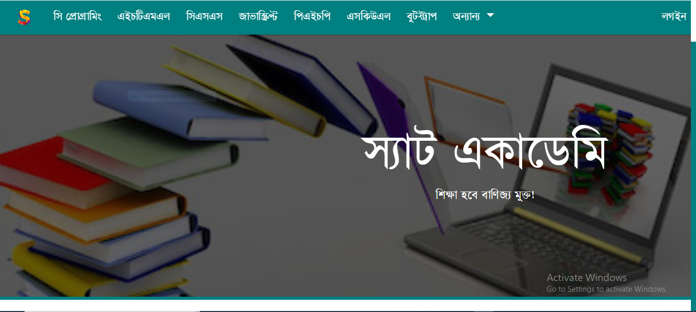

- **[One Of The Most Important Unique Website For Learning Web-Development ▶](https://www.quackit.com/)**
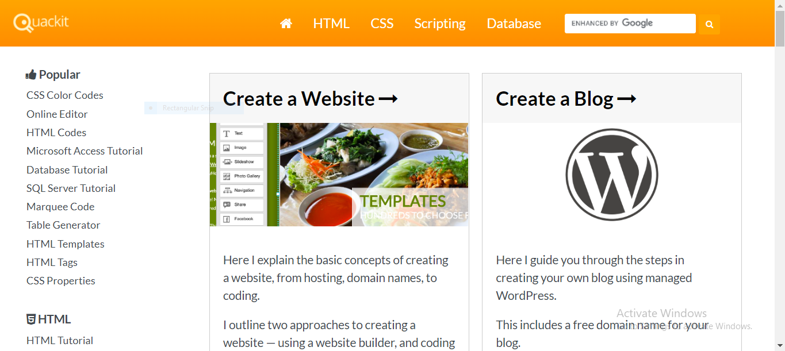


- **[Improtant Hidden WebSite For Learning Programming ▶](https://devdocs.io/)**


----

#### [Go to top:arrow_up: ](#top)

<a name="compiler"></a>

### Best Online Free Compiler ‍💻
- **[OneCompiler Best Online Website For Pactise Coding ▶](https://onecompiler.com/)**


- **[Tetorial Republic Compiler Best Online Website For Pactise Coding ▶](https://onecompiler.com/)**


- **[Teutorial Brains Compiler Best Online Website For Pactise Coding ▶](https://www.tutorialbrain.com/editor_html/html_tutorial_html_example.html)**


- **[Programiz Best Online Website For Pactise Coding ▶](https://www.programiz.com/html/online-compiler/)**


- **[PlayCode.Io Best Online Website For Pactise Coding ▶](https://playcode.io/html)**


- **[ Best Online Website For Pactise Coding ▶](https://onecompiler.com/)**


- **[ CodePen.IO Most Popular Website For Pactise Coding  ▶](https://codepen.io/)**


----

#### [Go to top:arrow_up: ](#top)

<a name="cssesWeb"></a>

### Most Important Website For Csses ‍💻
- **[ Animation Css Generator ▶](https://webcode.tools/generators/css/keyframe-animation)**


- **[ Guess CSS! ▶](https://www.guess-css.app/)**
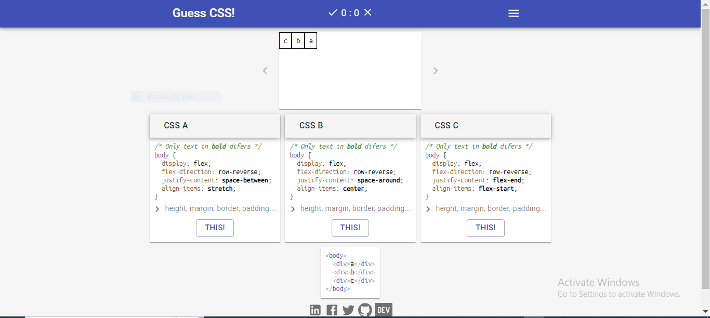

- **[ Speedrun CSS ▶](https://css-speedrun.netlify.app/)**


- **[CSSBattle! ▶](https://cssbattle.dev/)**


- **[ 100 DAYS CSS CHALLENGE ▶](https://100dayscss.com/)**


- **[ Most Important WebSite For Many Tools Provide CSS ▶](https://www.web2generators.com/)**


- **[ 10 Useful CSS Layout Generators (Grid & Flexbox) ▶](https://stackdiary.com/css-layout-generators/#Layout-Generators-for-Grid-&-Flexbox)**


---

#### [Go to top:arrow_up: ](#top)

<a name="cssTricks"></a>

### Most Important Website For CSS TIPS & TRICKS ‍💻
- **[ CSS-TRICKS ▶](https://css-tricks.com/)**


- **[ Fronted Masters This Website For Provide Free Learning Resource CSS ▶](https://frontendmasters.com/learn/css/)**


- **[ CSS Reference ▶](https://cssreference.io/)**


<!-- - **[ CSS-TRICKS ▶](https://css-tricks.com/)**


- **[ CSS-TRICKS ▶](https://css-tricks.com/)**
 -->


---

#### [Go to top:arrow_up: ](#top)

<a name="cssColour"></a>

### CSS Color Palettes 💻
- **[ Flat Ui Colors ▶](https://flatuicolors.com/)**


- **[ Flat Ui Colors ▶](https://palettes.shecodes.io/)**


- **[ 1,671 CSS Color Palettes ▶](https://flatuicolors.com/)**


- **[ Color palette generator ▶](https://mybrandnewlogo.com/color-palette-generator)**


- **[ Color Hunt ▶](https://colorhunt.co/)**


----

#### [Go to top:arrow_up: ](#top)

<a name="cssFontIcon"></a>

### CSS Font & Icons WebSite 💻
- **[ Google Fonts ▶](https://fonts.google.com/)**


- **[ Google Web Fonts 101Fonts.com ▶](https://www.1001fonts.com/google-web-fonts.html)**
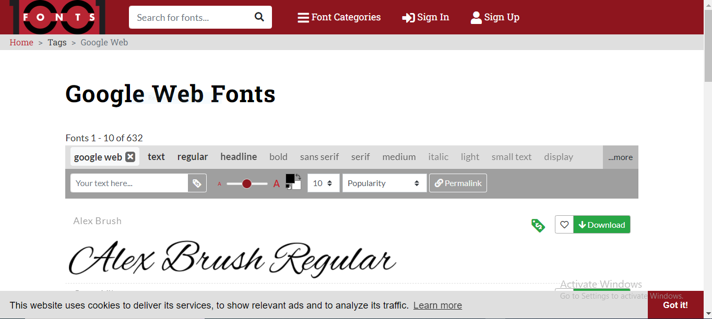


- **[ DaFont One Of The Popular Website For Provide Free Awesome Font ▶](https://www.dafont.com/)**
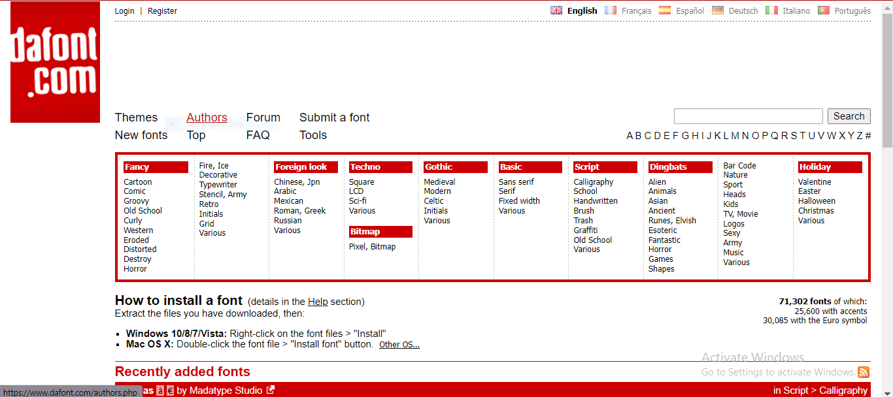


- **[ FontSpace ▶](https://www.fontspace.com/popular/fonts)**
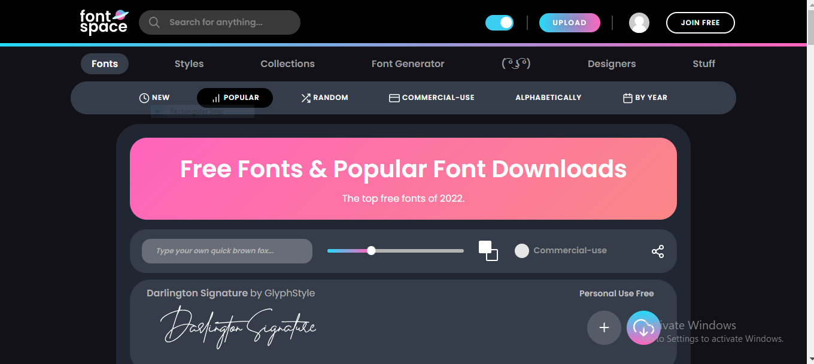


- **[ FontAwesome Most Popular Website For Provide Free Icons ▶](https://fontawesome.com/)**
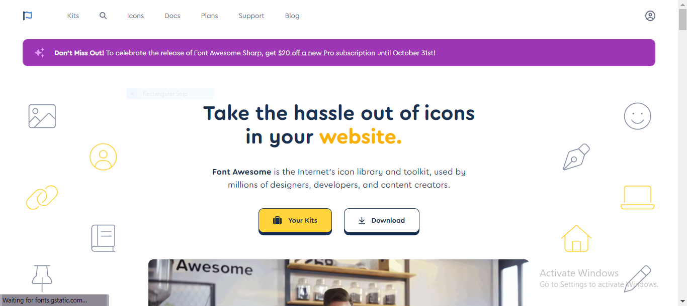


```


  <!-- font awesome cdn file link up  -->
  <link rel="stylesheet" href="https://use.fontawesome.com/releases/v5.7.0/css/all.css"/>

```


- **[ HeroIcons ▶](https://heroicons.com/)**
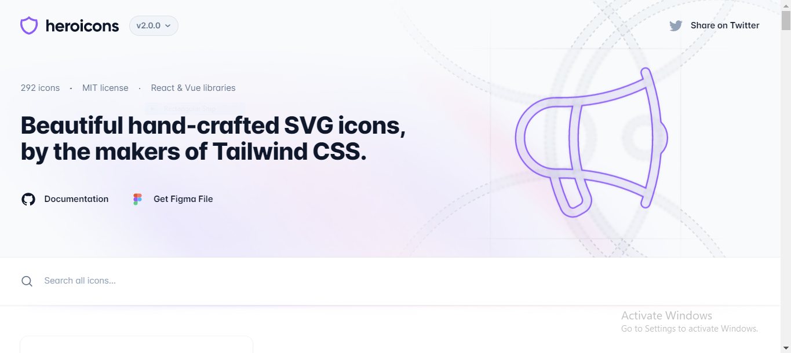


- **[ IcoNic App ▶](https://iconic.app/)**


- **[ FlatIcon One Of The Most Popular Website For Downloade Free Image,png,icons,vectors ▶](https://www.flaticon.com/)**
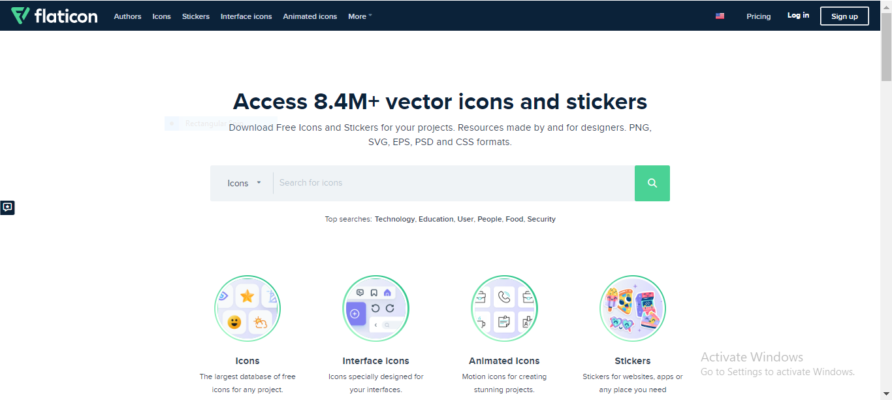


- **[ ionIcons My Favorite Free Awesome icon Download WebSite  ▶](https://ionic.io/ionicons)**

### Cdn Link UP ( ionIcons ) ✅
```
<script src="https://unpkg.com/ionicons@latest/dist/ionicons.js"></script>
```

### Basic Usage ( ionIcons ) 💠
```
<ion-icon name="heart"></ion-icon> <!--filled-->
<ion-icon name="heart-outline"></ion-icon> <!--outline-->
<ion-icon name="heart-sharp"></ion-icon> <!--sharp-->
```


- **[ FeatherIcons ▶](https://feathericons.com/)**
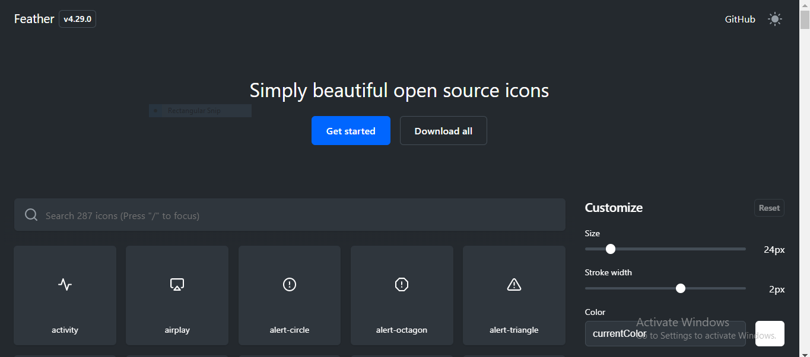


- **[ TableIcons ▶](https://tablericons.com/)**
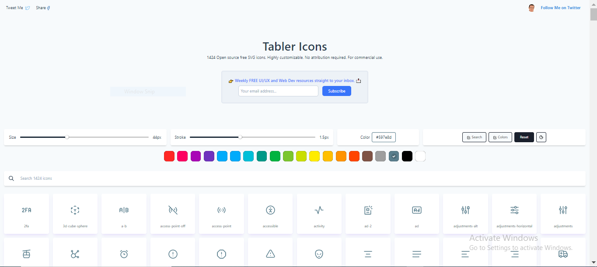


- **[ SimpleIcons ▶](https://simpleicons.org/)**
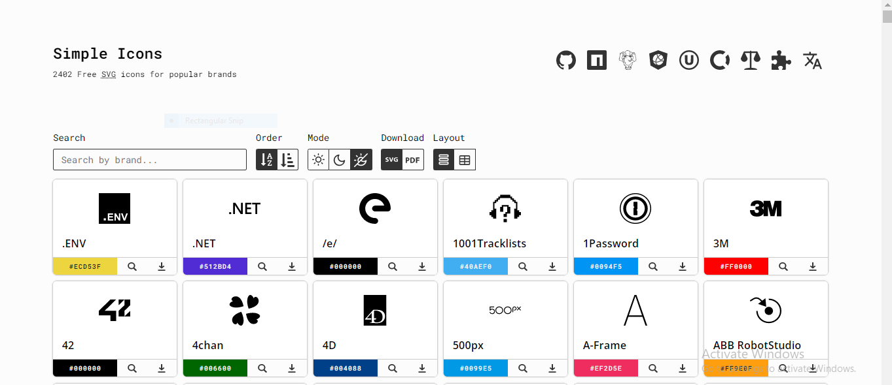


- **[ Eva Icons ▶](https://akveo.github.io/eva-icons/#/)**


- **[ icoMoon ▶](https://icomoon.io/app/#/select)**
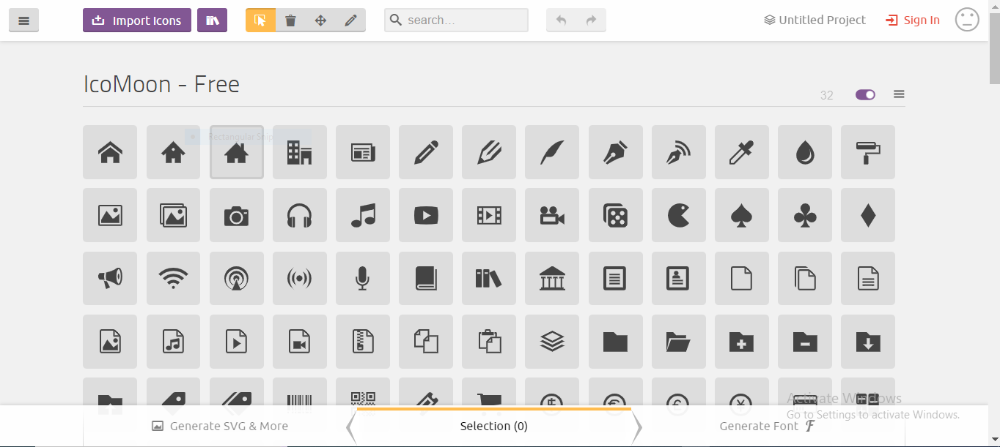


- **[ Icons8 This Website Provide Free Awesome Icons Add Also Provide Graphic Design All Resourcees ▶](https://icons8.com/icons)**


----

#### [Go to top:arrow_up: ](#top)

<a name="graphicDesign"></a>

### Most Important WebSite For Download Graphic-Design Resourcees 💻
- **[ Beautiful Art & Illustration MixKit ▶](https://mixkit.co/free-stock-art/?__cf_chl_tk=HfdvH0kzNezCK8N1k.Yu4afCGpwBUZRCQXZl4zf6Z2Q-1666884245-0-gaNycGzNCJE)**


- **[ Free Graphics Design Resourcees ▶](https://delesign.com/free-designs/graphics/)**


- **[ Undraw.co Most Popular Website For Provide Free Modern Illustrations Download ▶](https://undraw.co/illustrations)**


- **[ Free Template.net ▶](https://www.template.net/)**


----

#### [Go to top:arrow_up: ](#top)

<a name="simg"></a>

### Free WebSite For Provide Stock Imgs 💻
- **[ Pixabay Most Popular Website For Provide Free Stock Img & Videos ▶](https://pixabay.com/)**


- **[Pixels The best free stock photos, royalty free images & videos shared by creators. ▶](https://www.pexels.com/)**


- **[ Unsplash ▶](https://unsplash.com/)**


- **[ Vecteezy Download free vector art, stock photos & videos ▶](https://www.vecteezy.com/)**


- **[ Free Png Img Provide Website ▶](https://freepngimg.com/)**


---

#### [Go to top:arrow_up: ](#top)

<a name="jsLearners"></a>

### Best Free Awesome WebSite For JavaScript Learners 💻
- **[ Code Academy Learn JavaScript  ▶](https://www.codecademy.com/learn/introduction-to-javascript)**

>Learn how to use JavaScript — a powerful and flexible programming language for adding website interactivity.


- **[ JavaScript Hero Best Website For Pactise JavaScript Code ▶](https://www.jshero.net/en/home.html)**

>Learn to code with JS Hero, the JavaScript tutorial with interactive exercises.
On each page you will find a lesson and an exercise. Answer the task directly on the page. Run the tests and you'll see if you did the job right.


- **[edabit Most Popular Website For Pactise JavaScript Programming ▶](https://edabit.com/tutorials)**


- **[ JavaScript exercism ( ***Practice 139 exercises in JavaScript*** ) ▶](https://exercism.org/tracks/javascript/exercises)**


- **[ JSchallenger ▶](https://jschallenger.com/)**


- **[One Of The Most Popular Website For Begginer JavaScript Learners Mdn JavaScript Web Docs  ▶](https://developer.mozilla.org/en-US/docs/Web/JavaScript)**


- **[One Of The Best WebSite For  JavaScript Learners  ▶](https://with.zonayed.me/js)**


- **[The Modern JavaScript Tutorial JavaScript.Info ▶](https://javascript.info/)**


- **[Learn JavaScript This Is The Modern WebSite For Pactise JavaScript ▶](https://learnjavascript.online/)**


---

#### [Go to top:arrow_up: ](#top)


### Best YouTube Channel For Beginner & Intermediate WebDevelopers, Programmers,Cooders & UI/UX Designers 💻


#### Imporant YouTube Channel For Bangla Language Learners 💜

<a name="yBanglaLanguage"></a>


- **[Learn with Sumit - LWS - Bangladesh  ](https://www.youtube.com/c/LearnwithSumit)**


- **[Hablu Programmer  ](https://www.youtube.com/c/HabluProgrammer1)**


- **[freeCodeCamp Bengali  ](https://www.youtube.com/channel/UCYl5XjGuTM1gbXUuxH1e0jA/featured)**


#### Imporant YouTube Channel For Hindi Language Learners 💜

<a name="yHindiLanguage"></a>


- **[Thapa Technical  ](https://www.youtube.com/c/ThapaTechnical)**


- **[freeCodeCamp Hindi  ](https://www.youtube.com/channel/UClHVZQqHLfbcbwFDwPfdB-A)**


- **[Code Step By Step  ](https://www.youtube.com/c/phpstepbystep)**


- **[Yahoo Baba  ](https://www.youtube.com/c/YahooBaba)**


- **[Tech Gun  ](https://www.youtube.com/c/TechGun)**


- **[WsCube Tech  ](https://www.youtube.com/c/wscubetechjodhpur/featured)**


- **[CodeWithHarry  ](https://www.youtube.com/c/CodeWithHarry)**


#### Imporant YouTube Channel For English Language Learners 💜


<a name="yEnglishLanguage"></a>


- **[freeCodeCamp.org   ](https://www.youtube.com/c/Freecodecamp)**


- **[TraversyMedia  ](https://www.youtube.com/c/TraversyMedia)**


- **[Programming with Mosh  ](https://www.youtube.com/c/programmingwithmosh)**


- **[DesignCourse  ](https://www.youtube.com/c/DesignCourse)**


#### Best YouTube Channel For Pactise All Types Projects 💜


<a name="yPactiseProject"></a>


- **[Coding Artist  ](https://www.youtube.com/c/CodingArtist)**


- **[codewithsadee  ]()**


- **[Going-To Internet  ](https://www.youtube.com/c/GoingToInternet/featured)**


- **[Bedimcode  ](https://www.youtube.com/c/Bedimcode/featured)**


- **[Easy Tutorials  ](https://www.youtube.com/c/EasyTutorialsVideo)**


- **[Online Tutorials Best YouTube Channel For Master Of Css Learners  ](https://www.youtube.com/c/OnlineTutorials4Designers)**


- **[CODE4EDUCATION Modern WebDevelopment Project Base YouTube Channel Hindi Learners  ](https://www.youtube.com/c/CODE4EDUCATION)**


- **[JavaScript Mastery One Of The Best Project Base YouTube Channel JavaScript Begginer React Learners   ](https://www.youtube.com/c/JavaScriptMastery)**


- **[EGATOR Modern WebDevelopment Project Base YouTube Channel  ](https://www.youtube.com/c/EGATORTUTORIALS)**


#### [Go to top:arrow_up: ](#top)


